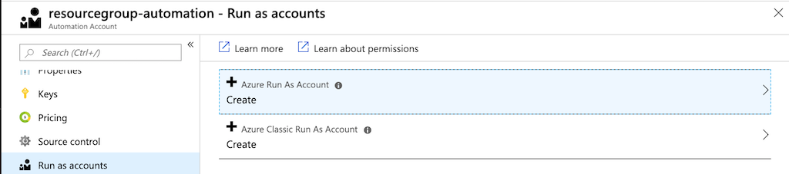
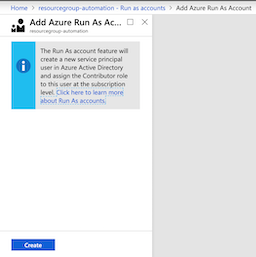
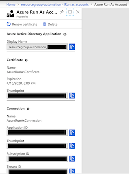
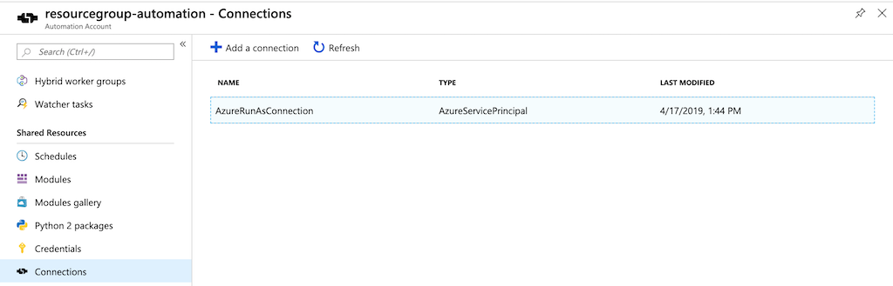

# Creation of Azure Resource Groups through Serverless Automatiion

## Introduction
A resource group in Azure is a container that holds Azure resources such as virtual machine instances, virtual networks, storage accounts, etc. It provides an accounting and security context for the life cycle of resources within its scope. Access to the resources within the boundaries of this scope is granted to security principals (which take the form of users or applications) in Azure Active Directory. The degree of access is determined by the policies attached to the roles assigned to these security principals. The costs incurred by any Azure resources can be managed as a unit.

Given its importance, a case can be made for an automated process that wraps sufficient business rules to enforce conformance in their creation.


## Solution

The institution has been adopting DevOps approaches and patterns of behavior. After a few months of manually creating and tagging resource groups through direct access of the Azure portal as well as the Powershell `Az` commandlets, the operational engineering team observes a pipeline of well-defined inputs and outputs emerging and a set of business rules coalescing around the naming conventions and tagging of the resource groups. They have refactored the Azure Resource Group templates and have begun to create a library of Powershell code snippets to reliably create appropriately named and tagged resource groups.

The next step is enabling the rest of the instition's technical teams to consume this automation.


### Manually create an Azure Resource Group

Although this solution is intended to create resource groups within a subscription, one must create an initial resource group to contain the components of the solution.

A resource group template that enforces business rules around naming and tagging will be used to create this resource group. (This template will also be used by the automated process to create subsequent resource groups.)

```powershell

# Replace all strings enclosed by `{{` and `}}` with specific values

Login-AzLogin -Subscription '{{ SUBSCRIPTION_NAME }}'

$AZURE_SUBSCRIPTION_ID = $(Get-AzContext).Subscription.Id
$AZURE_DEPLOYMENT = "resourcegroup-$(Get-Date -Format 'yyMMddHHmmm')-deployment"
$AZURE_DEPLOYMENT_LOCATION = '{{ DeploymentLocation }}'

$AZURE_DEPLOYMENT_PARAMETERS = @{}

$AZURE_DEPLOYMENT_PARAMETERS = @{
    ResourceLocation         = '{{ ResourceLocation }}'
    OwnerNetId               = '{{ OwnerNetId }}'
    OwnerDepartment          = '{{ OwnerDepartment }}'
    OwnerDepartmentContact   = '{{ OwnerDepartmentContact }}'
    ChargingAccount          = '{{ ChargingAccount }}'
    DataSensitivity          = '{{ DataSensitivity }}'
    Environment              = '{{ Environment }}'
    Application              = '{{ Application }}'
}


$deployment = New-AzDeployment -Name $AZURE_DEPLOYMENT `
                               -Location $AZURE_DEPLOYMENT_LOCATION `
                               -TemplateFile ./templates/resourcegroup/azuredeploy.json `
                               -TemplateParameterObject $AZURE_DEPLOYMENT_PARAMETERS

$AZURE_RESOURCE_GROUP = $deployment.Outputs.resourceGroupName.Value


```

### Create Storage Account and Upload ARM Template Artifacts to Blob Storage

An Azure Storage Account will be created to serve as an artifact repository for the Azure Resource Manager templates released by the developer/operator teams.

(Note, we will upload the resource group ARM template directly into the Azure Storage blob container. One can extend this solution by incorporating an Azure Devops Pipeline that outputs the resource group ARM template into this container.)

```powershell
# Create a storage account to park artifacts used by the Automation account
# Add deployment parameters to existing hashtable specific to Storage

$AZURE_STORAGE_ACCOUNT_DEPLOYMENT_PARAMETERS =  $AZURE_DEPLOYMENT_PARAMETERS + @{
    SkuName           = 'Standard_LRS'
    AccountKind       = 'StorageV2'
    AccessTierDefault = 'Hot'
    CustomDomain      = ''
}

$AZURE_DEPLOYMENT = "storageaccount-$(Get-Date -Format 'yyMMddHHmmm')-deployment"

$deploymentStorageAccount = New-AzResourceGroupDeployment -Name $AZURE_DEPLOYMENT `
                                                          -ResourceGroupName $AZURE_RESOURCE_GROUP `
                                                          -TemplateFile ./templates/storageaccount/azuredeploy.json `
                                                          -TemplateParameterObject $AZURE_STORAGE_ACCOUNT_DEPLOYMENT_PARAMETERS

$AZURE_STORAGE_ACCOUNT = $deploymentStorageAccount.Outputs.storageAccountName.Value
$AZURE_STORAGE_KEY = $(Get-AzStorageAccountKey -Name "$AZURE_STORAGE_ACCOUNT" -ResourceGroupName "$AZURE_RESOURCE_GROUP" | ? {$_.KeyName -eq 'key1'}).Value


$AZURE_STORAGE_CONTEXT = New-AzStorageContext -StorageAccountName "$AZURE_STORAGE_ACCOUNT" `
                        -StorageAccountKey "$AZURE_STORAGE_KEY"

# Create containers to hold template and PS module artifacts
New-AzStorageContainer -Context $AZURE_STORAGE_CONTEXT -Name 'templates'

# Upload template files
Get-ChildItem -Recurse ./templates -Filter '*.json' | % {Set-AzStorageBlobContent -File $_ -Context $AZURE_STORAGE_CONTEXT -Container 'templates' -Blob $($_.Directory.Name + '/' + $_.Name) -Properties @{"ContentType" = "application/json"} }

```

### Create Azure Automation Account

An Azure Automation Account is a container that holds the assets necessary to perform automation tasks against Azure resources, as well as external resources. The Azure automation account comprises common assets such scripts and workflows, modules, and variables. It can accommodate Python2 and PoweShell, two high-level interpreted languages commonly used by system administrators for routine automation tasks. An automation account posseses a service principal that is granted a `Contributor` role to the subscription.


```powershell
# Create Automation Account
$automationAccount = New-AzAutomationAccount -Name 'resourcegroup-automation' `
                                             -ResourceGroupName $AZURE_RESOURCE_GROUP `
                                             -Location $AZURE_DEPLOYMENT_LOCATION `
                                             -Plan basic

$AZURE_AUTOMATION_ACCOUNT_NAME = $automationAccount.AutomationAccountName

# Establish variables for the runbook to use
New-AzAutomationVariable -AutomationAccountName $AZURE_AUTOMATION_ACCOUNT_NAME `
                         -ResourceGroupName $AZURE_RESOURCE_GROUP `
                         -Encrypted $False `
                         -Name 'AZURE_STORAGE_ACCOUNT' `
                         -Value $AZURE_STORAGE_ACCOUNT

New-AzAutomationVariable -AutomationAccountName $AZURE_AUTOMATION_ACCOUNT_NAME `
                         -ResourceGroupName $AZURE_RESOURCE_GROUP `
                         -Encrypted $False `
                         -Name 'AZURE_STORAGE_ACCOUNT_RESOURCEGROUP' `
                         -Value $AZURE_RESOURCE_GROUP

New-AzAutomationVariable -AutomationAccountName $AZURE_AUTOMATION_ACCOUNT_NAME `
                         -ResourceGroupName $AZURE_RESOURCE_GROUP `
                         -Encrypted $False `
                         -Name 'AZURE_STORAGE_CONTAINER' `
                         -Value 'templates'

New-AzAutomationVariable -AutomationAccountName $AZURE_AUTOMATION_ACCOUNT_NAME `
                         -ResourceGroupName $AZURE_RESOURCE_GROUP `
                         -Encrypted $False `
                         -Name 'AZURE_TEMPLATE_BLOB' `
                         -Value 'resourcegroup/azuredeploy.json'

# Add Necessary Az modules

$AZURE_AUTOMATION_MODULES = @(
    'Az.Accounts',
    'Az.Resources',
    'Az.Storage'
) | % {Find-Module -Name $_ -Repository PSGallery}


$AZURE_AUTOMATION_MODULES | % {
    New-AzAutomationModule -AutomationAccountName $AZURE_AUTOMATION_ACCOUNT_NAME `
                           -ResourceGroupName $AZURE_RESOURCE_GROUP `
                           -ContentLink $('{0}/package/{1}/{2}' -f $_.RepositorySourceLocation, $_.Name, $_.Version) `
                           -Name $_.Name
}


#$runbook = New-AzAutomationRunbook -Name 'ResourceGroup' `
#                                   -AutomationAccountName $automationAccount.automationAccountName `
#                                   -ResourceGroupName $AZURE_RESOURCE_GROUP `
#                                   -Type powershell

Import-AzAutomationRunbook -Path .\runbook\New-ResourceGroup.ps1 `
                           -ResourceGroupName $AZURE_RESOURCE_GROUP `
                           -AutomationAccountName $AZURE_AUTOMATION_ACCOUNT_NAME `
                           -Type PowerShell

```

In the Azure Portal, creating an Azure Automation Account creates an Azure Runas Account. (Actually, it creates two accounts--each corresponding to Azure Resource Manager and Azure Classic.)

Microsoft provides a convenient script [New-RunasAccount.ps1](https://docs.microsoft.com/en-us/azure/automation/manage-runas-account) that creates a new self-signed certificate, creates an application service principal associated witht he automatin account, creates an automation connection, and assignes the `Contributor` role to the service principal over a specified subscription.

Because this script assumes a Windows server environment, it will not work with PowerShell Core (Dotnet Core). It will be necessary to use the Azure Portal.

(**TODO**: Incorporate [SelfSignedCertificate](https://www.powershellgallery.com/packages/SelfSignedCertificate/0.0.4) module for pure CLI implementation.)

Navigate to the Azure Portal page for the automation account **resourcegroup-automation** and select **Run as accounts** under **Account Settings**. Click on **Azure Run as Account**.



Click **Create** on the following blade:



This will result in a new Azure Automation Run as Account:



A corresponding **AzureRunAsConnection** will be created also and can be viewed under the **Shared Resources** of the ***resourcegroups-automation** Azure Automation Account:



In order for the automation account to access the storage blob, the `Azure Storage Blob Reader` role must be assigned to it. Returning to PowerShell:

```powershell

$AZURE_AUTOMATION_ACCOUNT_APPID = $(Get-AzADApplication -DisplayNameStartWith $('{0}_' -f $AZURE_AUTOMATION_ACCOUNT_NAME)).ApplicationId
$AZURE_STORAGE_ROLE_SCOPE = $('/subscriptions/{0}/resourceGroups/{1}/providers/Microsoft.Storage/storageAccounts/{2}/blobServices/default/containers/{3}' -f $AZURE_SUBSCRIPTION_ID, $AZURE_RESOURCE_GROUP, $AZURE_STORAGE_ACCOUNT, 'templates')

New-AzRoleAssignment -ApplicationId $AZURE_AUTOMATION_ACCOUNT_APPID `
    -RoleDefinitionName "Storage Blob Data Reader" `
    -Scope  "$AZURE_STORAGE_ROLE_SCOPE"


```


New-AzRoleAssignment -ApplicationId $AZURE_AUTOMATION_ACCOUNT_APPID `
                     -RoleDefinitionName 'Contributor' `
                     -Scope $('/subscriptions/{0}' -f $AZURE_SUBSCRIPTION_ID) `
                     -AllowDelegation
## Author

Vincent Balbarin <vincent.balbarin@yale.edu>

## References
https://docs.microsoft.com/en-us/azure/automation/manage-runas-account
https://docs.microsoft.com/en-us/azure/automation/automation-deploy-template-runbook
https://docs.microsoft.com/en-us/azure/azure-resource-manager/resource-group-template-deploy